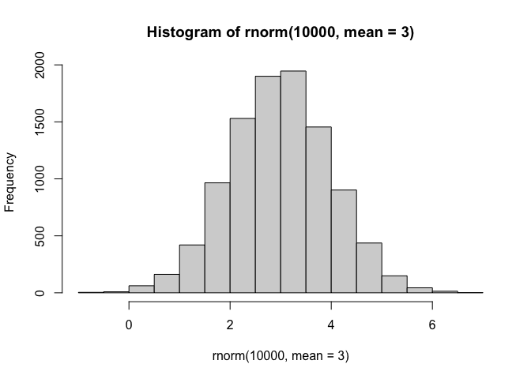
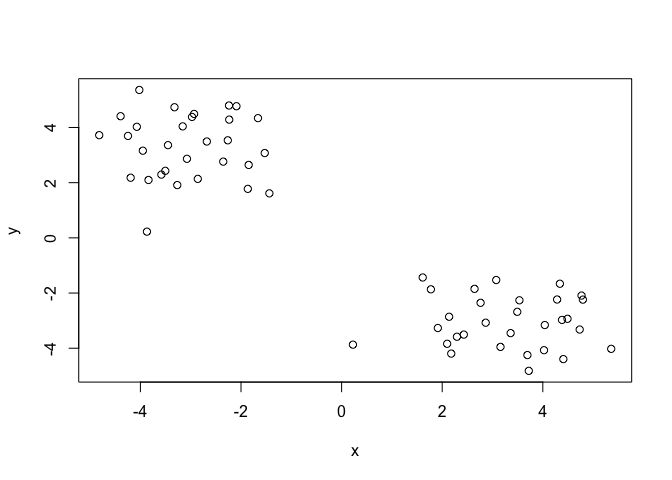
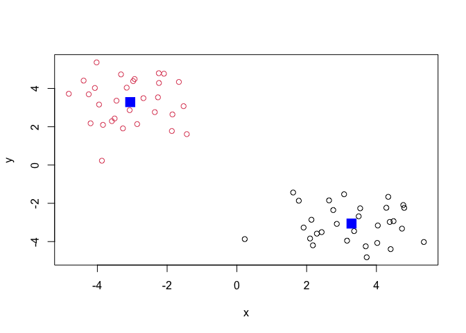
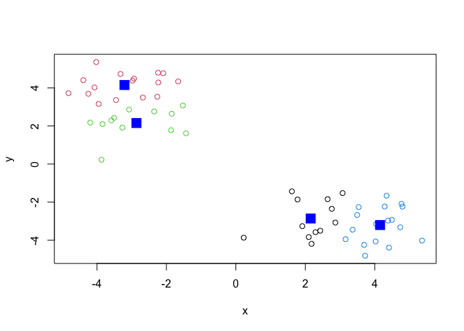
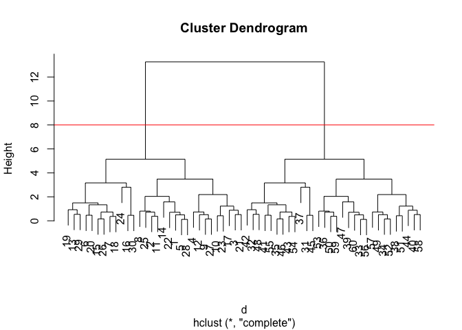
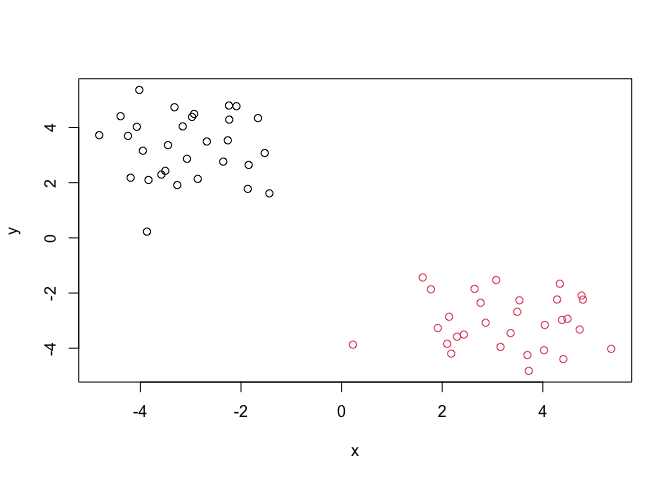
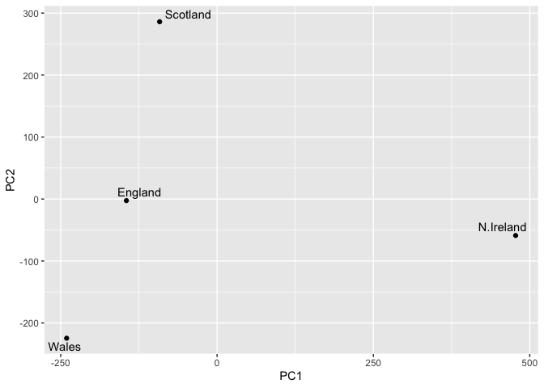

# Class 7: Machine Learning 1
Canbin Cai (A18087473)

- [Clustering](#clustering)
  - [K-means](#k-means)
  - [Hierarchical Clustering](#hierarchical-clustering)
- [Principal Component Analysis
  (PCA)](#principal-component-analysis-pca)
  - [Data import](#data-import)
  - [PCA to the rescue](#pca-to-the-rescue)
  - [Interperting PCA Results](#interperting-pca-results)

Today we will explore unsupervised machine learning methods starting
with clustering and dimensionality reduction.

## Clustering

To start let’s make up some data to cluster where we know what the
answer should be. The `rnorm()` function will help us here.

``` r
hist( rnorm(10000, mean=3) )
```



Return 30 numbers centered on -3

``` r
tmp <- c( rnorm(30, mean=-3), 
        rnorm(30, mean=3) )

x <- cbind(x=tmp, y=rev(tmp))

x
```

                   x          y
     [1,] -3.3223725  4.7330361
     [2,] -4.2472607  3.6936986
     [3,] -1.8478140  2.6427426
     [4,] -1.6625138  4.3393569
     [5,] -2.9326266  4.4907712
     [6,] -2.8591827  2.1373523
     [7,] -4.1941952  2.1796001
     [8,] -4.8192223  3.7213984
     [9,] -2.0908398  4.7701143
    [10,] -2.2625052  3.5349153
    [11,] -4.0710477  4.0241589
    [12,] -2.2341351  4.2847406
    [13,] -3.4514958  3.3603826
    [14,] -4.0219392  5.3597337
    [15,] -3.5054023  2.4295345
    [16,] -1.8647385  1.7752642
    [17,] -1.5280023  3.0734304
    [18,] -3.8388552  2.0982382
    [19,] -3.0747223  2.8645174
    [20,] -3.2674001  1.9129472
    [21,] -2.3532887  2.7627044
    [22,] -3.1591232  4.0398852
    [23,] -2.6796502  3.4921254
    [24,] -3.8700696  0.2251523
    [25,] -4.3938531  4.4082625
    [26,] -3.5833481  2.2928599
    [27,] -2.2385839  4.7966397
    [28,] -2.9740005  4.3815090
    [29,] -3.9516054  3.1585963
    [30,] -1.4361030  1.6124742
    [31,]  1.6124742 -1.4361030
    [32,]  3.1585963 -3.9516054
    [33,]  4.3815090 -2.9740005
    [34,]  4.7966397 -2.2385839
    [35,]  2.2928599 -3.5833481
    [36,]  4.4082625 -4.3938531
    [37,]  0.2251523 -3.8700696
    [38,]  3.4921254 -2.6796502
    [39,]  4.0398852 -3.1591232
    [40,]  2.7627044 -2.3532887
    [41,]  1.9129472 -3.2674001
    [42,]  2.8645174 -3.0747223
    [43,]  2.0982382 -3.8388552
    [44,]  3.0734304 -1.5280023
    [45,]  1.7752642 -1.8647385
    [46,]  2.4295345 -3.5054023
    [47,]  5.3597337 -4.0219392
    [48,]  3.3603826 -3.4514958
    [49,]  4.2847406 -2.2341351
    [50,]  4.0241589 -4.0710477
    [51,]  3.5349153 -2.2625052
    [52,]  4.7701143 -2.0908398
    [53,]  3.7213984 -4.8192223
    [54,]  2.1796001 -4.1941952
    [55,]  2.1373523 -2.8591827
    [56,]  4.4907712 -2.9326266
    [57,]  4.3393569 -1.6625138
    [58,]  2.6427426 -1.8478140
    [59,]  3.6936986 -4.2472607
    [60,]  4.7330361 -3.3223725

Make a plot of `x`

``` r
plot(x)
```



### K-means

The main function in “base” R for K-means clustering is called
`kmeans()`:

``` r
km <- kmeans(x, centers = 2)
km
```

    K-means clustering with 2 clusters of sizes 30, 30

    Cluster means:
              x         y
    1  3.286538 -3.057863
    2 -3.057863  3.286538

    Clustering vector:
     [1] 2 2 2 2 2 2 2 2 2 2 2 2 2 2 2 2 2 2 2 2 2 2 2 2 2 2 2 2 2 2 1 1 1 1 1 1 1 1
    [39] 1 1 1 1 1 1 1 1 1 1 1 1 1 1 1 1 1 1 1 1 1 1

    Within cluster sum of squares by cluster:
    [1] 67.21176 67.21176
     (between_SS / total_SS =  90.0 %)

    Available components:

    [1] "cluster"      "centers"      "totss"        "withinss"     "tot.withinss"
    [6] "betweenss"    "size"         "iter"         "ifault"      

The `kmeans()` function return a “list” with 9 components. You can see
the named components of any list with the `attributes()` function.

``` r
attributes(km)
```

    $names
    [1] "cluster"      "centers"      "totss"        "withinss"     "tot.withinss"
    [6] "betweenss"    "size"         "iter"         "ifault"      

    $class
    [1] "kmeans"

> Q. How many points are in each cluster ?

``` r
km$size 
```

    [1] 30 30

> Q. Cluster assignment/membership vector?

``` r
km$cluster
```

     [1] 2 2 2 2 2 2 2 2 2 2 2 2 2 2 2 2 2 2 2 2 2 2 2 2 2 2 2 2 2 2 1 1 1 1 1 1 1 1
    [39] 1 1 1 1 1 1 1 1 1 1 1 1 1 1 1 1 1 1 1 1 1 1

> Q. Cluster centers?

``` r
km$centers
```

              x         y
    1  3.286538 -3.057863
    2 -3.057863  3.286538

> Q. Make a plot of our `kmeans()` results showing cluster assignment
> using different colors for each cluster/group of points and cluster
> centers in blue.

``` r
plot(x, col=km$cluster) 
points(km$centers, col="blue", pch=15, cex=2)
```



> Q. Run `kmeans()` again on `x` and this cluster into 4 groups/clusters
> and plot the same result figure as above.

``` r
km4 <- kmeans(x, centers = 4)
km4
```

    K-means clustering with 4 clusters of sizes 13, 17, 13, 17

    Cluster means:
              x         y
    1  2.154371 -2.863317
    2 -3.206634  4.152313
    3 -2.863317  2.154371
    4  4.152313 -3.206634

    Clustering vector:
     [1] 2 2 3 2 2 3 3 2 2 2 2 2 2 2 3 3 3 3 3 3 3 2 2 3 2 3 2 2 2 3 1 4 4 4 1 4 1 4
    [39] 4 1 1 1 1 1 1 1 4 4 4 4 4 4 4 1 1 4 4 1 4 4

    Within cluster sum of squares by cluster:
    [1] 17.25778 19.67962 17.25778 19.67962
     (between_SS / total_SS =  94.5 %)

    Available components:

    [1] "cluster"      "centers"      "totss"        "withinss"     "tot.withinss"
    [6] "betweenss"    "size"         "iter"         "ifault"      

``` r
plot(x, col=km4$cluster) 
points(km4$centers, col="blue", pch=15, cex=2)
```



> **Key-point**: K-means clustering is super popular but can be
> miss-used. One big limitation is that it can impose a clustering
> pattern on your data even if clear natural grouping don’t exist -
> i.e. it does what you tell it to do in terms of `centers`.

### Hierarchical Clustering

The main function in “base” R for hierarchincal clustering is called
`hclust()`.

You can’t just pass our dataset as is into `hclust()` you must give
“distance matrix” as input. We can get this from the `dist()` function
in R.

``` r
d <- dist(x)
hc <- hclust(d)
hc
```


    Call:
    hclust(d = d)

    Cluster method   : complete 
    Distance         : euclidean 
    Number of objects: 60 

The results of `hclust()` don’t have a useful `print()` method but do
have a special `plot()` method.

``` r
plot(hc)
abline(h=8, col="red")
```



To get our main cluster assignment (membership vector) we need to “cut”
the tree at the big goal posts…

``` r
grps <- cutree(hc, h=8)
grps
```

     [1] 1 1 1 1 1 1 1 1 1 1 1 1 1 1 1 1 1 1 1 1 1 1 1 1 1 1 1 1 1 1 2 2 2 2 2 2 2 2
    [39] 2 2 2 2 2 2 2 2 2 2 2 2 2 2 2 2 2 2 2 2 2 2

``` r
table(grps)
```

    grps
     1  2 
    30 30 

``` r
plot(x, col=grps)
```



Hierarchical clustering is distinct in that the dendrogram (tree figure)
can reveal the potential grouping in your data (unlike K-means).

## Principal Component Analysis (PCA)

PCA is a common and highly useful dimensionality reduction technique
used in many fields - particulary bioinformatics.

Here we will analyze some data from the UK on food consumption.

### Data import

``` r
url <- "https://tinyurl.com/UK-foods"
x <- read.csv(url)

head (x)
```

                   X England Wales Scotland N.Ireland
    1         Cheese     105   103      103        66
    2  Carcass_meat      245   227      242       267
    3    Other_meat      685   803      750       586
    4           Fish     147   160      122        93
    5 Fats_and_oils      193   235      184       209
    6         Sugars     156   175      147       139

``` r
rownames(x) <- x[,1]
x <- x[,-1]
head(x)
```

                   England Wales Scotland N.Ireland
    Cheese             105   103      103        66
    Carcass_meat       245   227      242       267
    Other_meat         685   803      750       586
    Fish               147   160      122        93
    Fats_and_oils      193   235      184       209
    Sugars             156   175      147       139

``` r
x <- read.csv(url, row.names = 1)
head(x)
```

                   England Wales Scotland N.Ireland
    Cheese             105   103      103        66
    Carcass_meat       245   227      242       267
    Other_meat         685   803      750       586
    Fish               147   160      122        93
    Fats_and_oils      193   235      184       209
    Sugars             156   175      147       139

``` r
barplot(as.matrix(x), beside=T, col=rainbow(nrow(x)))
```


``` r
barplot(as.matrix(x), beside=F, col=rainbow(nrow(x)))
```


One conventional plot that can be useful is called a “pairs” plot.

``` r
pairs(x, col=rainbow(nrow(x)), pch=16)
```


### PCA to the rescue

The main function in “base” R for PCA is `prcomp()`.

``` r
pca <- prcomp( t(x) )
summary(pca) 
```

    Importance of components:
                                PC1      PC2      PC3       PC4
    Standard deviation     324.1502 212.7478 73.87622 2.921e-14
    Proportion of Variance   0.6744   0.2905  0.03503 0.000e+00
    Cumulative Proportion    0.6744   0.9650  1.00000 1.000e+00

The `prcomp()` function returns a list object of our results with five
attributes/components.

``` r
attributes(pca)
```

    $names
    [1] "sdev"     "rotation" "center"   "scale"    "x"       

    $class
    [1] "prcomp"

The two main “results” in here are `pca$x` and `pca$rotation`. The first
of these (`pca$x`) contains the scores of the data on the new PC axis -
we use these to make our “PCA plot”.

``` r
pca$x 
```

                     PC1         PC2        PC3           PC4
    England   -144.99315   -2.532999 105.768945 -9.152022e-15
    Wales     -240.52915 -224.646925 -56.475555  5.560040e-13
    Scotland   -91.86934  286.081786 -44.415495 -6.638419e-13
    N.Ireland  477.39164  -58.901862  -4.877895  1.329771e-13

### Interperting PCA Results

``` r
library(ggplot2)
library(ggrepel)

# Make a plot of pca$x with PC1 vs PC2 
ggplot(pca$x) + 
  aes(PC1, PC2, label=rownames(pca$x)) +
  geom_point() +
  geom_text_repel()
```



> This plot shows the differences between the two PCAs, where the
> distance between each point shows the variable for the different
> countries, i.e. the average consumption of the 17 food types.

> N. Ireland is more far away towards the PC1, so their average eating
> habits may be quite different from the other three countries.
> Similarly, Scotland is more far away towards PC2, and they may also
> have different eating habits. England and Wales are pretty close,
> where their diet may be influenced by both food variables.

The second major result is contained in the `pca$rotation` object or
component. Let’s plot this to see what PCA is picking up…

``` r
ggplot(pca$rotation) +
  aes(PC1, rownames(pca$rotation)) +
  geom_col()
```


> This plot shows the food variables in PC1, with each bar reflecting
> the consumption of each of the 17 food items.

> In connection with the first plot (PC1 vs. PC2), N. Ireland is on the
> far right, so they are likely to have consumed a lot more fresh
> potatoes and soft drinks compared to the other three countries.
> Meanwhile, Scotland, England, and Wales are on the left side of the
> plot, so they are likely to consume more fresh fruit and alcoholic
> drinks.
