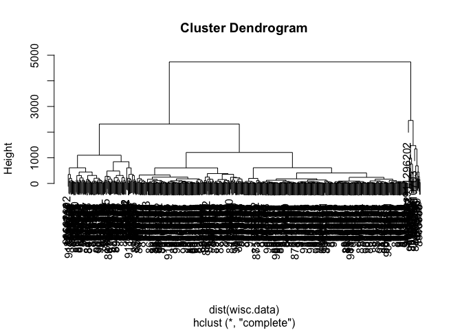
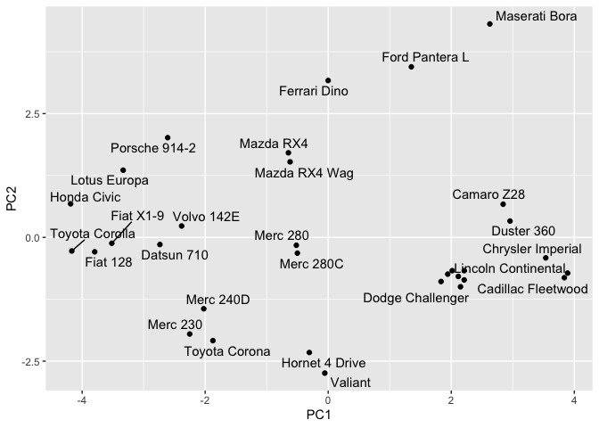
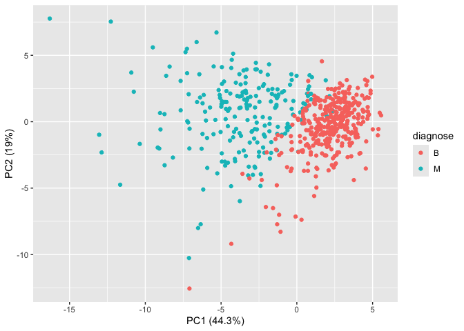
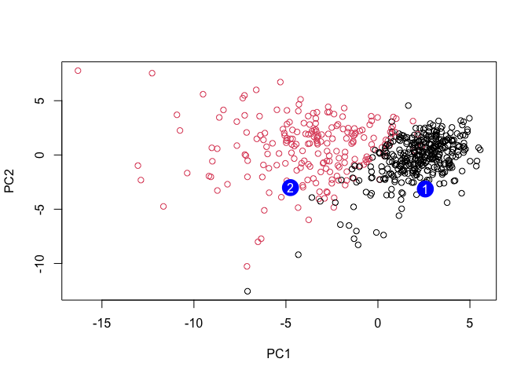

# Class 8: Breast cancer mini project
Canbin Cai (A18087473)

- [Background](#background)
- [Data import](#data-import)
- [Clustering](#clustering)
- [Principal Component Analysis](#principal-component-analysis)
  - [The importance of data scaling](#the-importance-of-data-scaling)
  - [PCA of wisc.data](#pca-of-wiscdata)
  - [5. Combining Methods](#5-combining-methods)
  - [Clustering on PCA results](#clustering-on-pca-results)
- [7. Prediction](#7-prediction)

## Background

This mini-project explores unsupervised learning techniques applied to
the Wisconsin Breast Cancer Diagnostic Data Set, which contains
measurements of human breast mass cell nuclei. The project guides the
user through exploratory data analysis, performing and interpreting
Principal Component Analysis (PCA) to reduce the dimensionality of the
data while retaining variance, and applying hierarchical clustering with
different linkage methods. The ultimate goal is to combine PCA and
clustering to better separate benign and malignant cell samples,
evaluate the result using metrics like sensitivity and specificity, and
finally demonstrate how to predict the classification of new samples
using the developed PCA model.

## Data import

Our data come from the U. of Wiscosin Medical Center.

``` r
wisc.df <- read.csv("WisconsinCancer.csv", row.names=1)
```

> Q1. How many patients/samples are in this dataset?

``` r
nrow(wisc.df)
```

    [1] 569

> Q2. How many of the observations have a malignant diagnosis?

``` r
table(wisc.df$diagnosis)
```


      B   M 
    357 212 

``` r
sum(wisc.df$diagnosis == "M")
```

    [1] 212

> Q3. How many variables/features in the data are suffixed with \_mean?

``` r
colnames(wisc.df)
```

     [1] "diagnosis"               "radius_mean"            
     [3] "texture_mean"            "perimeter_mean"         
     [5] "area_mean"               "smoothness_mean"        
     [7] "compactness_mean"        "concavity_mean"         
     [9] "concave.points_mean"     "symmetry_mean"          
    [11] "fractal_dimension_mean"  "radius_se"              
    [13] "texture_se"              "perimeter_se"           
    [15] "area_se"                 "smoothness_se"          
    [17] "compactness_se"          "concavity_se"           
    [19] "concave.points_se"       "symmetry_se"            
    [21] "fractal_dimension_se"    "radius_worst"           
    [23] "texture_worst"           "perimeter_worst"        
    [25] "area_worst"              "smoothness_worst"       
    [27] "compactness_worst"       "concavity_worst"        
    [29] "concave.points_worst"    "symmetry_worst"         
    [31] "fractal_dimension_worst"

``` r
length( grep("mean", colnames(wisc.df), value = T) )
```

    [1] 10

There is a diagnosis column that is the clinician consenus that I want
to exclude from any further analysis. We will come back later and
compare our results to this diagnosis.

``` r
diagnose <- as.factor( wisc.df$diagnosis ) 
head(diagnose) 
```

    [1] M M M M M M
    Levels: B M

Now we can remove it from the `wisc.df`

``` r
wisc.data <- wisc.df[,-1]
```

## Clustering

Let’s try a `hclust()`

``` r
hc <- hclust( dist(wisc.data))
plot(hc)
```



We can extract clusters from this rather poor dendrogram/tree with the
`cutree()`

``` r
grps <- cutree(hc, k=2)
```

> How many individuals in each cluster?

``` r
table(grps)
```

    grps
      1   2 
    549  20 

``` r
table(diagnose)
```

    diagnose
      B   M 
    357 212 

We can generate a cross-table that compares our cluster `grps` vector
without `diagnosis` vector values **(in my case, it’s `diagnose`)**

``` r
table(diagnose, grps)
```

            grps
    diagnose   1   2
           B 357   0
           M 192  20

## Principal Component Analysis

### The importance of data scaling

The main function for PCA in “base” R is `prcomp()` it has a dafault
input parameter of `scale=FALSE`.

``` r
#prcomp()
head(mtcars)
```

                       mpg cyl disp  hp drat    wt  qsec vs am gear carb
    Mazda RX4         21.0   6  160 110 3.90 2.620 16.46  0  1    4    4
    Mazda RX4 Wag     21.0   6  160 110 3.90 2.875 17.02  0  1    4    4
    Datsun 710        22.8   4  108  93 3.85 2.320 18.61  1  1    4    1
    Hornet 4 Drive    21.4   6  258 110 3.08 3.215 19.44  1  0    3    1
    Hornet Sportabout 18.7   8  360 175 3.15 3.440 17.02  0  0    3    2
    Valiant           18.1   6  225 105 2.76 3.460 20.22  1  0    3    1

We could do a PCA of this data as is and it could be mis-leading…

``` r
pc <- prcomp(mtcars)
biplot(pc)
```


Let’s look at the mean values of each column and their standard
deviation.

``` r
colMeans(mtcars)
```

           mpg        cyl       disp         hp       drat         wt       qsec 
     20.090625   6.187500 230.721875 146.687500   3.596563   3.217250  17.848750 
            vs         am       gear       carb 
      0.437500   0.406250   3.687500   2.812500 

``` r
apply(mtcars, 2, sd)
```

            mpg         cyl        disp          hp        drat          wt 
      6.0269481   1.7859216 123.9386938  68.5628685   0.5346787   0.9784574 
           qsec          vs          am        gear        carb 
      1.7869432   0.5040161   0.4989909   0.7378041   1.6152000 

We can “scale” this data before PCA to get a much better represention
and analysus of all the columns.

``` r
mtscale <- scale(mtcars)
```

``` r
round( colMeans(mtscale) )
```

     mpg  cyl disp   hp drat   wt qsec   vs   am gear carb 
       0    0    0    0    0    0    0    0    0    0    0 

``` r
apply(mtscale, 2, sd)
```

     mpg  cyl disp   hp drat   wt qsec   vs   am gear carb 
       1    1    1    1    1    1    1    1    1    1    1 

``` r
pc.scale <- prcomp(mtscale)
```

We can look at the two main results figures from PCA - the “PC plot”
(a.k.a. score plot, ordienation plot, or PC1 vs PC2 plot). The “loadings
plot” - how the origional variables contribute to the new PCs.

A loadings plot of the unscaled PCA results

``` r
library(ggplot2)

ggplot(pc$rotation) +
  aes(PC1, rownames(pc$rotation)) +
  geom_col()
```


Loadings plot of the scaled data

``` r
ggplot(pc.scale$rotation) +
  aes(PC1, rownames(pc$rotation)) +
  geom_col()
```


PC plot of scaled PCA results

``` r
library(ggrepel)

ggplot(pc.scale$x) +
  aes(PC1, PC2, label=rownames(pc.scale$x)) +
  geom_point() +
  geom_text_repel()
```

    Warning: ggrepel: 6 unlabeled data points (too many overlaps). Consider
    increasing max.overlaps



``` r
pc$rotation
```

                  PC1          PC2          PC3          PC4         PC5
    mpg  -0.038118199  0.009184847  0.982070847  0.047634784 -0.08832843
    cyl   0.012035150 -0.003372487 -0.063483942 -0.227991962  0.23872590
    disp  0.899568146  0.435372320  0.031442656 -0.005086826 -0.01073597
    hp    0.434784387 -0.899307303  0.025093049  0.035715638  0.01655194
    drat -0.002660077 -0.003900205  0.039724928 -0.057129357 -0.13332765
    wt    0.006239405  0.004861023 -0.084910258  0.127962867 -0.24354296
    qsec -0.006671270  0.025011743 -0.071670457  0.886472188 -0.21416101
    vs   -0.002729474  0.002198425  0.004203328  0.177123945 -0.01688851
    am   -0.001962644 -0.005793760  0.054806391 -0.135658793 -0.06270200
    gear -0.002604768 -0.011272462  0.048524372 -0.129913811 -0.27616440
    carb  0.005766010 -0.027779208 -0.102897231 -0.268931427 -0.85520810
                  PC6          PC7           PC8          PC9         PC10
    mpg  -0.143790084 -0.039239174 -2.271040e-02 -0.002790139  0.030630361
    cyl  -0.793818050  0.425011021  1.890403e-01  0.042677206  0.131718534
    disp  0.007424138  0.000582398  5.841464e-04  0.003532713 -0.005399132
    hp    0.001653685 -0.002212538 -4.748087e-06 -0.003734085  0.001862554
    drat  0.227229260  0.034847411  9.385817e-01 -0.014131110  0.184102094
    wt   -0.127142296 -0.186558915 -1.561907e-01 -0.390600261  0.829886844
    qsec -0.189564973  0.254844548  1.028515e-01 -0.095914479 -0.204240658
    vs    0.102619063 -0.080788938  2.132903e-03  0.684043835  0.303060724
    am    0.205217266  0.200858874  2.273255e-02 -0.572372433 -0.162808201
    gear  0.334971103  0.801625551 -2.174878e-01  0.156118559  0.203540645
    carb -0.283788381 -0.165474186 -3.972219e-03  0.127583043 -0.239954748
                  PC11
    mpg   0.0158569365
    cyl  -0.1454453628
    disp -0.0009420262
    hp    0.0021526102
    drat  0.0973818815
    wt    0.0198581635
    qsec -0.0110677880
    vs   -0.6256900918
    am   -0.7331658036
    gear  0.1909325849
    carb -0.0557957968

> **Key point**: In general we will set`scale=TRUE` when we do PCA. This
> is not the default but probably should be…

We can check the SD and mean of the different columns in `wisc.data` to
see if we need to scale - hint: we do!

### PCA of wisc.data

``` r
wisc.pr <- prcomp(wisc.data, scale=TRUE)
```

To see how well PCA is doing here in terms capturing the variance (or
spread) in the data we can use the `summary()` function.

``` r
summary(wisc.pr)
```

    Importance of components:
                              PC1    PC2     PC3     PC4     PC5     PC6     PC7
    Standard deviation     3.6444 2.3857 1.67867 1.40735 1.28403 1.09880 0.82172
    Proportion of Variance 0.4427 0.1897 0.09393 0.06602 0.05496 0.04025 0.02251
    Cumulative Proportion  0.4427 0.6324 0.72636 0.79239 0.84734 0.88759 0.91010
                               PC8    PC9    PC10   PC11    PC12    PC13    PC14
    Standard deviation     0.69037 0.6457 0.59219 0.5421 0.51104 0.49128 0.39624
    Proportion of Variance 0.01589 0.0139 0.01169 0.0098 0.00871 0.00805 0.00523
    Cumulative Proportion  0.92598 0.9399 0.95157 0.9614 0.97007 0.97812 0.98335
                              PC15    PC16    PC17    PC18    PC19    PC20   PC21
    Standard deviation     0.30681 0.28260 0.24372 0.22939 0.22244 0.17652 0.1731
    Proportion of Variance 0.00314 0.00266 0.00198 0.00175 0.00165 0.00104 0.0010
    Cumulative Proportion  0.98649 0.98915 0.99113 0.99288 0.99453 0.99557 0.9966
                              PC22    PC23   PC24    PC25    PC26    PC27    PC28
    Standard deviation     0.16565 0.15602 0.1344 0.12442 0.09043 0.08307 0.03987
    Proportion of Variance 0.00091 0.00081 0.0006 0.00052 0.00027 0.00023 0.00005
    Cumulative Proportion  0.99749 0.99830 0.9989 0.99942 0.99969 0.99992 0.99997
                              PC29    PC30
    Standard deviation     0.02736 0.01153
    Proportion of Variance 0.00002 0.00000
    Cumulative Proportion  1.00000 1.00000

Let’s make the main PC1 vs PC2

``` r
ggplot(wisc.pr$x) +
  aes(PC1, PC2, col=diagnose) +
  geom_point() +
  xlab("PC1 (44.3%)") +
  ylab("PC2 (19%)")
```



> Q4. From your results, what proportion of the original variance is
> captured by the first principal components (PC1)?

``` r
summary(wisc.pr)
```

    Importance of components:
                              PC1    PC2     PC3     PC4     PC5     PC6     PC7
    Standard deviation     3.6444 2.3857 1.67867 1.40735 1.28403 1.09880 0.82172
    Proportion of Variance 0.4427 0.1897 0.09393 0.06602 0.05496 0.04025 0.02251
    Cumulative Proportion  0.4427 0.6324 0.72636 0.79239 0.84734 0.88759 0.91010
                               PC8    PC9    PC10   PC11    PC12    PC13    PC14
    Standard deviation     0.69037 0.6457 0.59219 0.5421 0.51104 0.49128 0.39624
    Proportion of Variance 0.01589 0.0139 0.01169 0.0098 0.00871 0.00805 0.00523
    Cumulative Proportion  0.92598 0.9399 0.95157 0.9614 0.97007 0.97812 0.98335
                              PC15    PC16    PC17    PC18    PC19    PC20   PC21
    Standard deviation     0.30681 0.28260 0.24372 0.22939 0.22244 0.17652 0.1731
    Proportion of Variance 0.00314 0.00266 0.00198 0.00175 0.00165 0.00104 0.0010
    Cumulative Proportion  0.98649 0.98915 0.99113 0.99288 0.99453 0.99557 0.9966
                              PC22    PC23   PC24    PC25    PC26    PC27    PC28
    Standard deviation     0.16565 0.15602 0.1344 0.12442 0.09043 0.08307 0.03987
    Proportion of Variance 0.00091 0.00081 0.0006 0.00052 0.00027 0.00023 0.00005
    Cumulative Proportion  0.99749 0.99830 0.9989 0.99942 0.99969 0.99992 0.99997
                              PC29    PC30
    Standard deviation     0.02736 0.01153
    Proportion of Variance 0.00002 0.00000
    Cumulative Proportion  1.00000 1.00000

44.27% is captured by PC1.

> Q5. How many principal components (PCs) are required to describe at
> least 70% of the original variance in the data?

3 PCs

> Q6. How many principal components (PCs) are required to describe at
> least 90% of the original variance in the data?

7 PCs

> Q7. What stands out to you about this plot? Is it easy or difficult to
> understand? Why?

``` r
biplot(wisc.pr)
```


This biplot is very hard to understand, because it’s too much going on
and hard to read, and we’re unable to see the trends.

Generate a standard scatter plot for PC1 and PC2:

``` r
# Scatter plot observations by components 1 and 2
plot(wisc.pr$x, col = diagnose , 
     xlab = "PC1", ylab = "PC2")
```


> Q8. Generate a similar plot for principal components 1 and 3. What do
> you notice about these plots?

``` r
# Repeat for components 1 and 3
plot(wisc.pr$x[, c(1,3) ], col = diagnose, 
     xlab = "PC1", ylab = "PC3")
```


The first plot (PC1 vs PC2) may better distinguish the malignant samples
(red dots) from the benign samples (black dots), with the second plot
(PC1 vs PC3) showing more overlapping.

> Q9. For the first principal component, what is the component of the
> loading vector (i.e. `wisc.pr$rotation[,1]`) for the feature
> `concave.points_mean`?

``` r
PC1 <- wisc.pr$rotation[,1]
concave_point <- PC1["concave.points_mean"]
print(concave_point)
```

    concave.points_mean 
             -0.2608538 

> Q10. What is the minimum number of principal components required to
> explain 80% of the variance of the data?

``` r
pr.var <- wisc.pr$sdev^2
head(pr.var)
```

    [1] 13.281608  5.691355  2.817949  1.980640  1.648731  1.207357

``` r
var <- cumsum(wisc.pr$sdev^2) / sum(wisc.pr$sdev^2)
var >= 0.80
```

     [1] FALSE FALSE FALSE FALSE  TRUE  TRUE  TRUE  TRUE  TRUE  TRUE  TRUE  TRUE
    [13]  TRUE  TRUE  TRUE  TRUE  TRUE  TRUE  TRUE  TRUE  TRUE  TRUE  TRUE  TRUE
    [25]  TRUE  TRUE  TRUE  TRUE  TRUE  TRUE

> Q11. Using the plot() and abline() functions, what is the height at
> which the clustering model has 4 clusters?

``` r
# Scale the wisc.data data using the "scale()" function
data.scaled <- scale(wisc.data)
```

``` r
data.dist <- dist(data.scaled)
wisc.hclust <- hclust(data.dist, method = "complete")
```

``` r
plot(wisc.hclust)
abline(wisc.hclust, col="red", lty=2)
```


> Q12. Can you find a better cluster vs diagnoses match by cutting into
> a different number of clusters between 2 and 10?

``` r
wisc.hclust.clusters <- cutree(wisc.hclust, k = 4)
table(wisc.hclust.clusters, diagnose)
```

                        diagnose
    wisc.hclust.clusters   B   M
                       1  12 165
                       2   2   5
                       3 343  40
                       4   0   2

``` r
wisc.hclust.clusters <- cutree(wisc.hclust, k = 2)
table(wisc.hclust.clusters, diagnose)
```

                        diagnose
    wisc.hclust.clusters   B   M
                       1 357 210
                       2   0   2

``` r
wisc.hclust.clusters <- cutree(wisc.hclust, k = 10)
table(wisc.hclust.clusters, diagnose)
```

                        diagnose
    wisc.hclust.clusters   B   M
                      1   12  86
                      2    0  59
                      3    0   3
                      4  331  39
                      5    0  20
                      6    2   0
                      7   12   0
                      8    0   2
                      9    0   2
                      10   0   1

> Q13. Which method gives your favorite results for the same data.dist
> dataset? Explain your reasoning.

I think the `cutree ()` function will probably give better data that’s
slightly easier to read. I’m still able to read the number of malignant
samples and benign samples in the table above. Overall, I prefer plots
over tables, which I think will be much easier to read and analyze.

### 5. Combining Methods

We can take our PCA results and use them as a basis set for other
analysis such as clustering.

### Clustering on PCA results

``` r
wisc.pr.hclust <- hclust( dist( wisc.pr$x[,1:2]), method="ward.D2" )
plot(wisc.pr.hclust)
```


We can “cut” this tree to yield our clusters (groups):

``` r
pc.grps <- cutree(wisc.pr.hclust, k=2)
table(pc.grps)
```

    pc.grps
      1   2 
    195 374 

> How do my cluster grps compare to the expert diagnosis?

``` r
table(diagnose, pc.grps)
```

            pc.grps
    diagnose   1   2
           B  18 339
           M 177  35

> Q15. How well does the newly created model with four clusters separate
> out the two diagnoses?

It’s still not really clear on understanding the numbers of malignant
samples and benign samples.

``` r
table(diagnose)
```

    diagnose
      B   M 
    357 212 

> Q16. How well do the k-means and hierarchical clustering models you
> created in previous sections (i.e. before PCA) do in terms of
> separating the diagnoses? Again, use the `table()` function to compare
> the output of each model (`wisc.km$cluster` and
> `wisc.hclust.clusters`) with the vector containing the actual
> diagnoses.

``` r
wisc.km <- kmeans(wisc.data, centers = 2)
table(wisc.km$cluster, diagnose)
```

       diagnose
          B   M
      1   1 130
      2 356  82

``` r
wisc.hclust <- hclust(dist(wisc.data))
wisc.hclust.clusters <- cutree(wisc.hclust, k=4)
table(wisc.hclust.clusters, diagnose)
```

                        diagnose
    wisc.hclust.clusters   B   M
                       1   1 110
                       2 356  82
                       3   0  19
                       4   0   1

They did really badly. We do much better after PCA - the new PCA
variables (what we called a basis set) give us much better separation of
M and B.

## 7. Prediction

We can use our PCA model for the analysis of new “unseen” data. In this
case from U. Mich.

``` r
#url <- "new_samples.csv"
url <- "https://tinyurl.com/new-samples-CSV"
new <- read.csv(url)
npc <- predict(wisc.pr, newdata=new)
npc
```

               PC1       PC2        PC3        PC4       PC5        PC6        PC7
    [1,]  2.576616 -3.135913  1.3990492 -0.7631950  2.781648 -0.8150185 -0.3959098
    [2,] -4.754928 -3.009033 -0.1660946 -0.6052952 -1.140698 -1.2189945  0.8193031
                PC8       PC9       PC10      PC11      PC12      PC13     PC14
    [1,] -0.2307350 0.1029569 -0.9272861 0.3411457  0.375921 0.1610764 1.187882
    [2,] -0.3307423 0.5281896 -0.4855301 0.7173233 -1.185917 0.5893856 0.303029
              PC15       PC16        PC17        PC18        PC19       PC20
    [1,] 0.3216974 -0.1743616 -0.07875393 -0.11207028 -0.08802955 -0.2495216
    [2,] 0.1299153  0.1448061 -0.40509706  0.06565549  0.25591230 -0.4289500
               PC21       PC22       PC23       PC24        PC25         PC26
    [1,]  0.1228233 0.09358453 0.08347651  0.1223396  0.02124121  0.078884581
    [2,] -0.1224776 0.01732146 0.06316631 -0.2338618 -0.20755948 -0.009833238
                 PC27        PC28         PC29         PC30
    [1,]  0.220199544 -0.02946023 -0.015620933  0.005269029
    [2,] -0.001134152  0.09638361  0.002795349 -0.019015820

> Q18. Which of these new patients should we prioritize for follow up
> based on your results?

``` r
plot(wisc.pr$x[,1:2], col = diagnose)
points(npc[,1], npc[,2], col="blue", pch=16, cex=3)
text(npc[,1], npc[,2], c(1,2), col="white")
```



Based on this plot, (1) benign samples (black dots) are more clustered
and stable, and (2) the malignant samples (red dots) are more spread
out, so they are more variable/different. Therefore, (2) should be
prioritized for follow-up based on the result.
